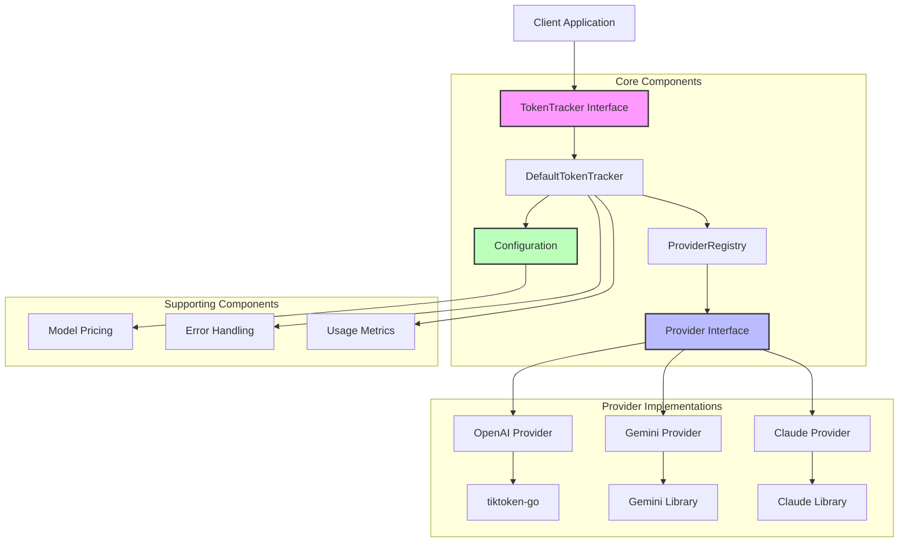
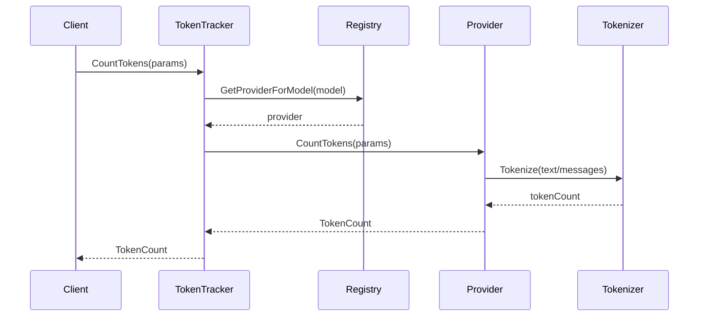
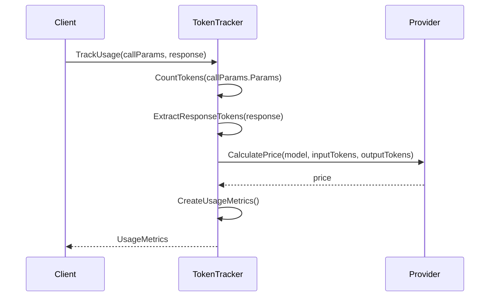

# Token Tracker Architecture

## Component Diagram



## Sequence Diagram - Token Counting Flow



## Sequence Diagram - Usage Tracking Flow



## Provider Registration Flow

```mermaid
graph LR
    A[Initialize TokenTracker] --> B[Create ProviderRegistry]
    B --> C[Register OpenAI Provider]
    C --> D[Register Gemini Provider]
    D --> E[Register Claude Provider]
    E --> F[Ready for Use]
    
    style A fill:#f9f,stroke:#333,stroke-width:1px
    style F fill:#bfb,stroke:#333,stroke-width:1px